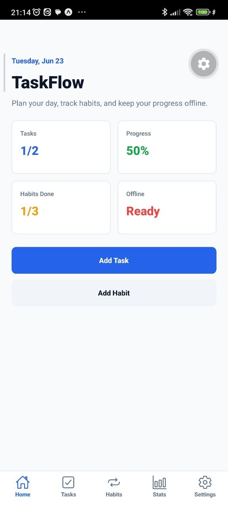
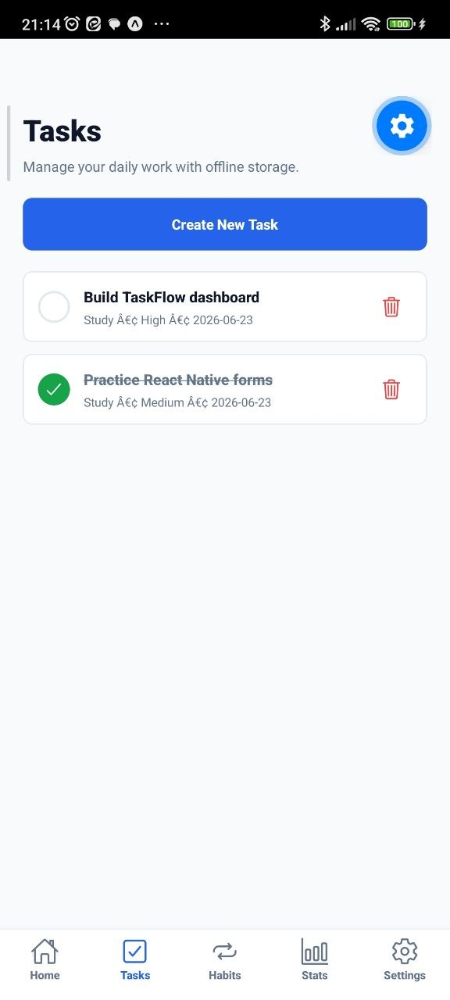
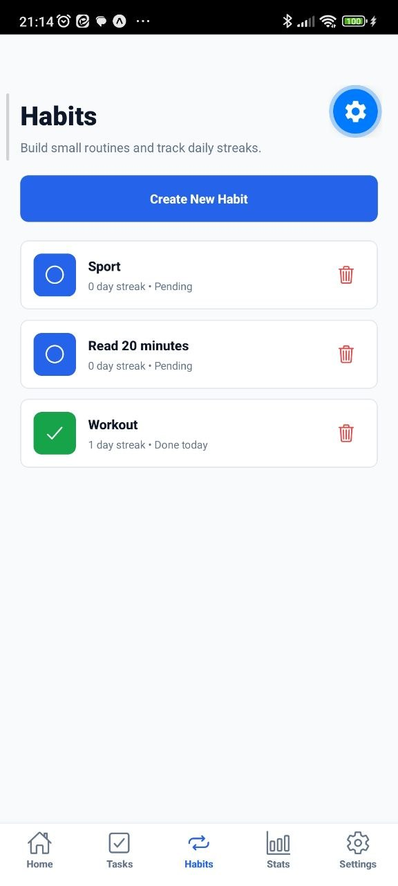
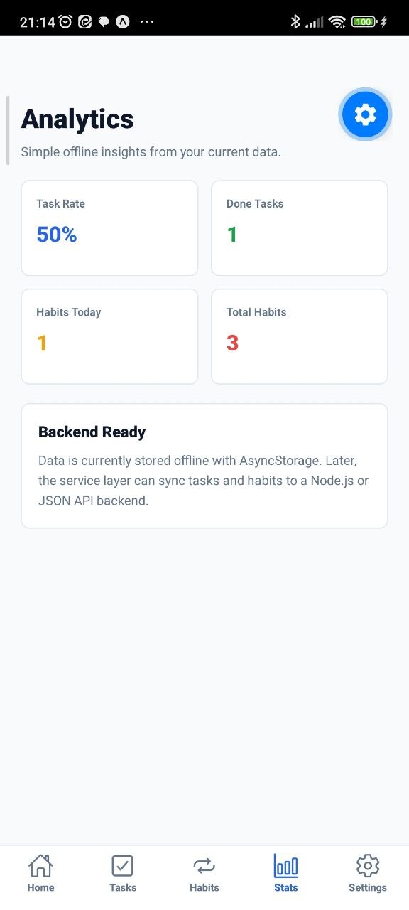
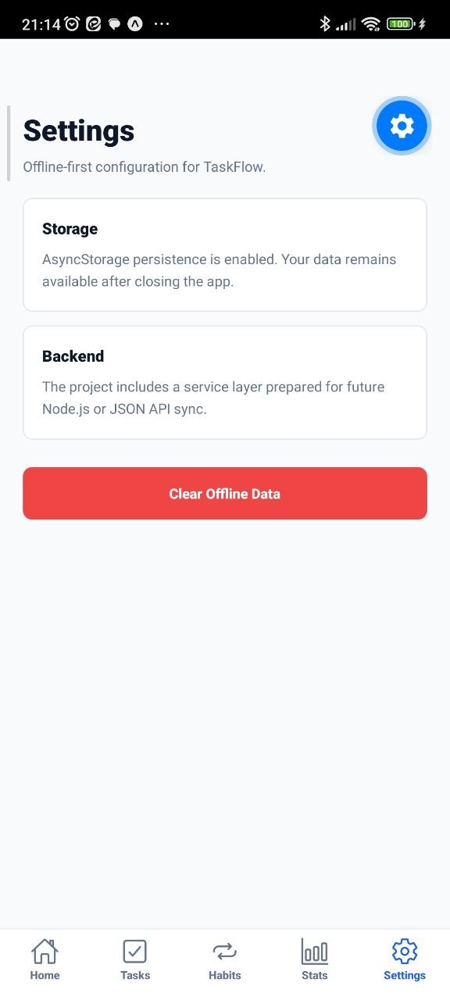

# TaskFlow React Native

TaskFlow React Native is an offline-first mobile productivity app built with Expo, React Native, TypeScript, Expo Router, Zustand, and AsyncStorage.

The app helps users manage tasks, track habits, review productivity statistics, and use a clean mobile workflow without requiring a backend connection.

## Technologies

| Part | Technology |
|---|---|
| Framework | Expo |
| UI | React Native |
| Language | TypeScript |
| Navigation | Expo Router |
| State Management | Zustand |
| Local Storage | AsyncStorage |
| Build Tool | EAS Build / Android Gradle |

## Screens

<table>
<tr>
<td width="260">

</td>
<td>
<strong>Home Screen</strong> 
The Home screen is the main dashboard of the app. It shows the user's daily overview, productivity summary, quick actions, and entry points for tasks, habits, statistics, and settings.
</td>
</tr>

<tr>
<td width="260">

</td>
<td>
<strong>Tasks Screen</strong> 
The Tasks screen is used for managing daily tasks. Users can add tasks, mark them as completed, and keep their workflow organized locally on the device.
</td>
</tr>

<tr>
<td width="260">

</td>
<td>
<strong>Habits Screen</strong> 
The Habits screen helps users track recurring habits and daily consistency. Habit progress is stored offline using AsyncStorage.
</td>
</tr>

<tr>
<td width="260">

</td>
<td>
<strong>Stats Screen</strong> 
The Stats screen displays productivity analytics, including task completion and habit tracking progress. It gives users a clear view of their performance.
</td>
</tr>

<tr>
<td width="260">

</td>
<td>
<strong>Settings Screen</strong> 
The Settings screen contains app preferences and configuration options for managing the local app experience.
</td>
</tr>
</table>

## Features

- Offline-first task management
- Habit tracking with local persistence
- Productivity statistics
- Expo Router navigation
- Zustand state management
- AsyncStorage local data storage
- TypeScript-based project structure
- Ready for Android APK builds

## Project Structure
`	ext
app/
src/
  components/
  constants/
  services/
  store/
  types/
  utils/
docs/
  screenshots/

## Run The App

bash
npm install
npx expo start --lan --clear

## Build APK Locally

bash
npx expo prebuild --platform android
cd android
gradlew.bat assembleDebug

APK output path:

text
android/app/build/outputs/apk/debug/app-debug.apk

## Repository

text
https://github.com/alirezanaseri548/taskflow-react-native
